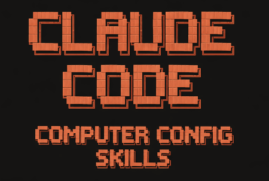

# Computer Configuration Skills

A collection of Claude Code skills for installing software and configuring computers.

## Usage

1. Clone this repository:
   ```bash
   git clone <repo-url>
   cd computer-conf-skills
   ```

2. Run Claude Code:
   ```bash
   claude
   ```

3. Ask Claude to install or configure things:
   - "Install Zellij"
   - "Set up Node.js"
   - "Update Zellij to the latest version"
   - "Uninstall Zellij"

Claude will use the available skills to guide the installation and configuration process.

## Available Skills

| Skill | Description |
|-------|-------------|
| `configure-claude-code` | Apply personalized Claude Code settings |
| `manage-zellij-installation` | Install and configure Zellij terminal multiplexer |

## Creating New Skills

Ask Claude to create a new skill:
- "Create a skill for installing Docker"
- "Add a skill for configuring Git"

Skills are stored in `.claude/skills/<skill-name>/SKILL.md` and include installation, verification, update, and uninstall instructions.
